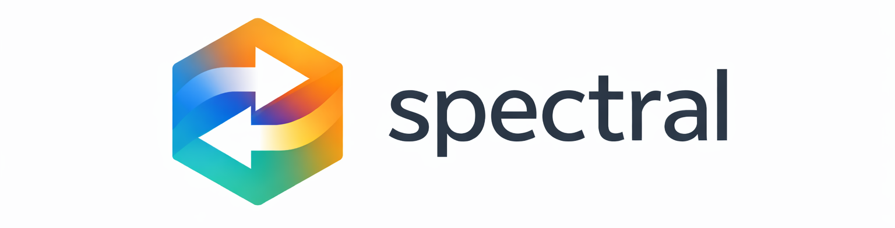

<p align="center">
  
</p>

Reverse-engineer any app's private API. Browse normally, get a full spec — then use it to build AI agents and automations instead of brittle browser scripts.

Most apps sit on undocumented APIs that work perfectly well. But without a spec, people fall back to Playwright/Selenium/Puppeteer: slow, fragile, breaks on every UI change, can't handle mobile. Spectral captures the traffic, has an LLM figure out what each call means, and gives you a spec you can actually use.

Supports both **REST** (outputs OpenAPI 3.1) and **GraphQL** (outputs SDL with inferred types).

**[Documentation](https://romain-gilliotte.github.io/spectral/)**

## How it works

1. **Capture** — Chrome extension (web) or MITM proxy records traffic + UI actions while you browse
2. **Analyze** — LLM correlates UI actions with API calls, infers endpoint patterns, auth flow, and business meaning
3. **Call** — Generated Restish config + auth helper let you call the API immediately from the command line

## Quick start

Prerequisites: Python 3.11+, [uv](https://docs.astral.sh/uv/), [Anthropic API key](https://console.anthropic.com/).

```bash
git clone https://github.com/romain-gilliotte/spectral.git && cd spectral
uv sync
echo "ANTHROPIC_API_KEY=sk-ant-..." > .env
```

Capture traffic with the Chrome extension or the MITM proxy:

```bash
# Chrome extension: load extension/ as unpacked in chrome://extensions
# then: Start Capture → browse → Stop Capture → Export Bundle

# Or use the MITM proxy
uv run spectral capture proxy -o capture.zip
```

Analyze the capture to produce an API spec:

```bash
uv run spectral analyze capture.zip -o myapp-api
# → myapp-api.yaml (OpenAPI 3.1)
# → myapp-api.graphql (SDL schema, if GraphQL detected)
# → myapp-api.restish.json (Restish config)
# → myapp-api-auth.py (auth helper, if auth detected)
```

Call the API with [Restish](https://rest.sh/):

```bash
restish api edit < myapp-api.restish.json
restish myapp-api get-user-profile
```

See the [getting started guide](https://romain-gilliotte.github.io/spectral/getting-started/installation/) for detailed setup, or the [CLI reference](https://romain-gilliotte.github.io/spectral/reference/cli/) for all commands.

## Capture methods

| Method                                                                                            | Best for                | UI context                             | Needs certification installation |
| ------------------------------------------------------------------------------------------------- | ----------------------- | -------------------------------------- | -------------------------------- |
| [Chrome extension](https://romain-gilliotte.github.io/spectral/capture/chrome-extension/)         | Web apps                | Yes — clicks, navigation, page content | No                               |
| [MITM proxy](https://romain-gilliotte.github.io/spectral/capture/mitm-proxy/)                     | CLI tools, desktop apps | No                                     | Yes — [setup guide](https://romain-gilliotte.github.io/spectral/capture/certificate-setup/) |
| [Android APK patching + MITM proxy](https://romain-gilliotte.github.io/spectral/capture/android/) | Mobile apps             | No                                     | Yes — [setup guide](https://romain-gilliotte.github.io/spectral/capture/certificate-setup/) |

## License

[MIT](LICENSE)
