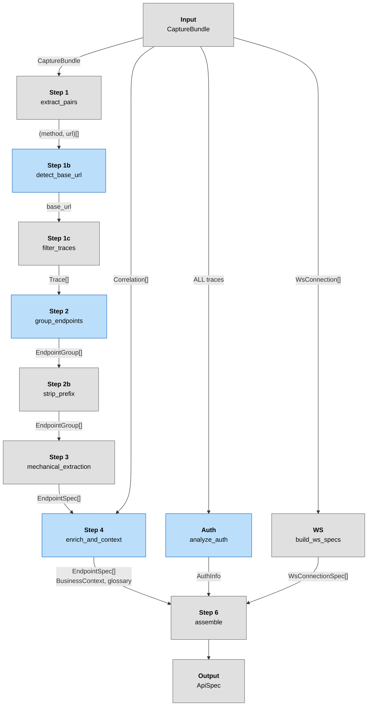

# Analysis Pipeline — Overview

The analysis pipeline transforms a raw `CaptureBundle` into an enriched `ApiSpec` using a combination of LLM inference and mechanical extraction.

**Detailed documentation per step:**
- [01 — Detect Base URL](./01-detect-base-url.md) — LLM identifies the business API origin
- [02 — Group Endpoints](./02-group-endpoints.md) — LLM groups URLs into endpoint patterns
- [03 — Mechanical Extraction](./03-mechanical-extraction.md) — schemas, params, UI triggers, correlator
- [04 — Enrich + Business Context](./04-enrich-and-context.md) — single LLM call for all endpoints
- [05 — Auth Analysis](./05-auth-analysis.md) — LLM finds auth flow from ALL traces (parallel)

---

## Step Abstraction

Every stage of the pipeline is a **Step** with typed input and output. The pipeline doesn't need to know whether a step is LLM-based or mechanical — it just calls `run()` and gets a typed result.

Three classes:

- **`Step[In, Out]`** — Base class. Calls `_execute()` then `_validate_output()`. Raises on validation errors.
- **`LLMStep[In, Out]`** — Extends `Step`. On validation errors, retries by appending errors to the LLM conversation (up to `max_retries`). If retries exhausted, calls `_fallback()` (override to provide a degraded result instead of raising).
- **`MechanicalStep[In, Out]`** — Extends `Step`. No retry logic — if validation fails, it's a bug.

### All steps and their types

| Step | Class | In | Out | Details |
|---|---|---|---|---|
| Extract pairs | `MechanicalStep` | `CaptureBundle` | `list[tuple[str, str]]` | [overview](#trivial-mechanical-steps) |
| Detect base URL | `LLMStep` | `list[tuple[str, str]]` | `str` | [01-detect-base-url](./01-detect-base-url.md) |
| Filter traces | `MechanicalStep` | `(list[Trace], str)` | `list[Trace]` | [overview](#trivial-mechanical-steps) |
| Group endpoints | `LLMStep` | `list[tuple[str, str]]` | `list[EndpointGroup]` | [02-group-endpoints](./02-group-endpoints.md) |
| Strip prefix | `MechanicalStep` | `(list[EndpointGroup], str)` | `list[EndpointGroup]` | [overview](#trivial-mechanical-steps) |
| Mechanical extraction | `MechanicalStep` | `(list[EndpointGroup], list[Trace])` | `list[EndpointSpec]` | [03-mechanical-extraction](./03-mechanical-extraction.md) |
| Enrich + context | `LLMStep` | `(list[EndpointSpec], list[Correlation], str, str)` | `(list[EndpointSpec], BusinessContext, dict)` | [04-enrich-and-context](./04-enrich-and-context.md) |
| Auth analysis | `LLMStep` | `list[Trace]` | `AuthInfo` | [05-auth-analysis](./05-auth-analysis.md) (no tools, summary-based) |
| WebSocket specs | `MechanicalStep` | `list[WsConnection]` | `WebSocketProtocol` | [overview](#trivial-mechanical-steps) |
| Assemble | `MechanicalStep` | all above | `ApiSpec` | [overview](#trivial-mechanical-steps) |

### `_validate_output` per LLM Step

| LLM Step | `_validate_output` checks |
|---|---|
| **Detect base URL** | Valid URL (scheme + host). At least N% of traces match. Not a known CDN/tracker domain. |
| **Group endpoints** | Every filtered trace URL assigned to a group. Each URL matches its group's pattern. No duplicate `(method, pattern)`. |
| **Auth analysis** | Best-effort — no validation yet. Empty fields acceptable. Fallback to `_detect_auth_mechanical()`. |
| **Enrich + context** | Best-effort — no validation, `_validate_output` returns `[]`. Empty fields are acceptable. |

---

## Pipeline Diagram

Three parallel branches converge at assembly:
- **Main branch**: base URL detection → filtering → endpoint grouping → mechanical extraction → LLM enrichment
- **Auth branch** (parallel): auth analysis on ALL unfiltered traces
- **WS branch** (parallel): WebSocket specs from capture bundle

**Legend:** Blue = LLM step (with validation + retry), Grey = mechanical step

---

## Trivial Mechanical Steps

These steps are simple enough to describe here rather than in separate files.

### Extract pairs (Step 1)

Extracts `(method, url)` pairs from ALL traces in the bundle.

### Filter traces (Step 1c)

Keeps only traces whose URL starts with the detected base URL.

### Strip prefix (Step 2b)

Removes the base URL path prefix from endpoint patterns to avoid double prefixes (e.g. `base_url="/api"` + `pattern="/api/users"` → `pattern="/users"`).

### WebSocket specs (Step 5)

Mechanical extraction from `bundle.ws_connections`: protocol detection (`detect_ws_protocol`), message schema inference, payload examples. No LLM involved.

### Assemble (Step 6)

Combines all outputs into a single `ApiSpec`: enriched endpoints, auth info, business context, glossary, WebSocket specs.

---

## Appendix: Investigation Tools

Two LLM steps use `_call_with_tools()` to let the LLM drive exploration via tool calls: detect base URL and group endpoints. The auth step receives pre-built summaries instead of using tools.

| Tool | Used by | Description |
|---|---|---|
| `decode_base64` | detect base URL, group endpoints | Decodes standard or URL-safe base64 (auto-padding). Returns UTF-8 text or hex dump. |
| `decode_url` | detect base URL, group endpoints | URL-decodes percent-encoded strings (`%20` → space). |
| `decode_jwt` | detect base URL, group endpoints | Decodes JWT header + payload (no signature verification). Returns JSON. |

Tool execution loop (`_call_with_tools`):
- Sends messages to LLM with `tools` parameter
- If `stop_reason == "tool_use"`, executes tools locally and appends results
- Loops until LLM produces a text response (max 10 iterations)
- Errors in tool execution are returned as `is_error: true` tool results

## Appendix: Debug Mode

When `enable_debug=True` is passed to `build_spec()`, all LLM prompts and responses are saved to `debug/<timestamp>/` as text files. Each file is named `<timestamp>_<call_name>` and contains both the prompt and response.
