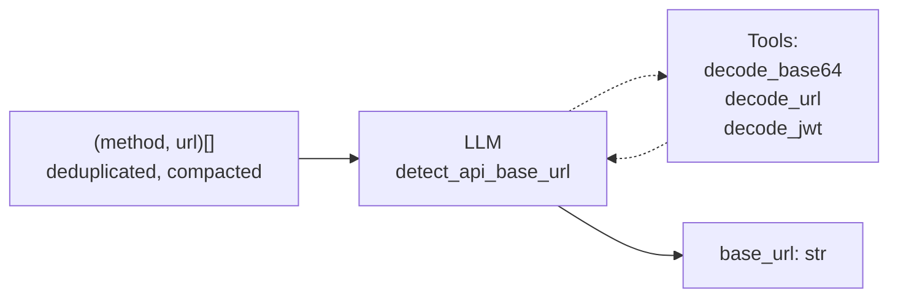

# Step 1b — Detect API Base URL

> `LLMStep[list[tuple[str, str]], str]`
>
> **In:** all `(method, url)` pairs (deduplicated, compacted) — **Out:** base URL string

[← Back to overview](./00-overview.md)

---

## Purpose

Identifies the business API base URL from captured traffic, filtering out CDNs, analytics, fonts, trackers, etc. The result is used to filter traces before endpoint grouping.

Examples of output: `"https://api.example.com"`, `"https://www.example.com/api"`

## Input preparation

Before sending to the LLM, URLs are **compacted** via `_compact_url()`:
- Query strings are stripped
- Path segments >60 chars that decode as valid base64 are replaced with `<base64:Nchars>`

This reduces token count without losing structural information.

## Prompt

> "Identify the base URL of the **business API**. Ignore CDN, analytics, trackers, fonts, static asset hosts. If endpoints share a common path prefix (e.g. `/api/v1`), include it. Return `{"base_url": "..."}`."

## Tools

Uses `_call_with_tools()` with:
- `decode_base64` — decode opaque path segments
- `decode_url` — decode percent-encoded strings
- `decode_jwt` — decode JWT tokens in URLs

## Flow

## Validation (`_validate_output`)

| Check | Description |
|---|---|
| Valid URL | Parseable URL with scheme + host |
| Trace coverage | At least N% of traces have URLs starting with this base |
| Not a CDN/tracker | Not a known analytics/CDN domain |

On failure: retry with errors appended to conversation.

## Configuration

| Parameter | Value |
|---|---|
| `max_tokens` | 4096 |
| `max_tool_iterations` | 10 |

## Fallback

No fallback — this is a critical step. If it fails after retry, the pipeline aborts.
