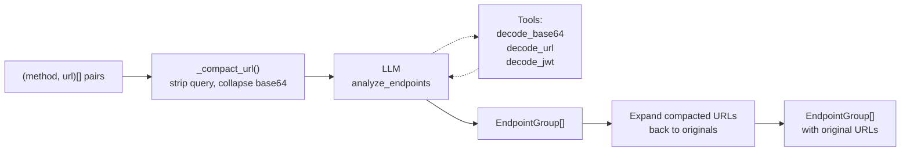

# Step 2 — Group Endpoints

> `LLMStep[list[tuple[str, str]], list[EndpointGroup]]`
>
> **In:** `(method, url)` pairs (filtered, compacted) — **Out:** endpoint groups with patterns

[← Back to overview](./00-overview.md)

---

## Purpose

Groups observed URLs into logical API endpoint patterns. Variable path segments (IDs, UUIDs, hashes, base64 tokens) become `{param_name}` placeholders.

Example: `GET /users/123/orders` + `GET /users/456/orders` → `GET /users/{user_id}/orders`

## Input preparation

URLs are **compacted** via `_compact_url()` (same as Step 1b). A reverse mapping `compact_to_originals` is built so that compacted URLs in the LLM response can be expanded back to the original URLs.

## Prompt

> "Group these URLs into API endpoints. Variable segments become `{param_name}`. Use investigation tools to decode opaque segments. Only include the path in the pattern."

## Tools

Uses `_call_with_tools()` with:
- `decode_base64` — decode opaque path segments to understand what they represent
- `decode_url` — decode percent-encoded strings
- `decode_jwt` — decode JWT tokens

## Flow

## Output structure

Each `EndpointGroup` contains: `method` (GET, POST...), `pattern` (e.g. `/api/users/{user_id}/orders`), and `urls` (original URLs assigned to this group).

## Validation (`_validate_output`)

| Check | Description |
|---|---|
| Coverage | Every filtered trace URL is assigned to at least one group |
| Pattern match | Each URL in a group matches the group's pattern (via `_pattern_to_regex`: `{param}` → `[^/]+`) |
| No duplicates | No two groups have the same `(method, pattern)` |

On failure: retry with the list of uncovered URLs and/or mismatched patterns.

## Post-processing (Step 2b)

After grouping, the base URL path prefix is stripped from patterns to avoid double prefixes (e.g. `base_url="/api"` + `pattern="/api/users/{user_id}"` → `"/users/{user_id}"`).

## Configuration

| Parameter | Value |
|---|---|
| `max_tokens` | 4096 |
| `max_tool_iterations` | 10 |

## Fallback

No fallback — this is a critical step. If it fails after retry, the pipeline aborts.
