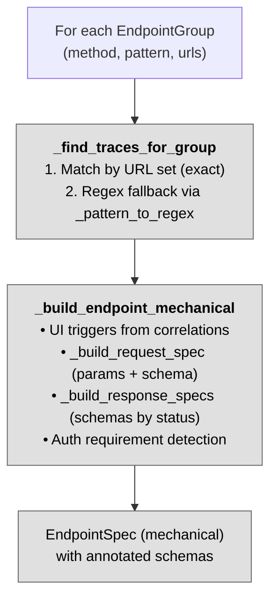
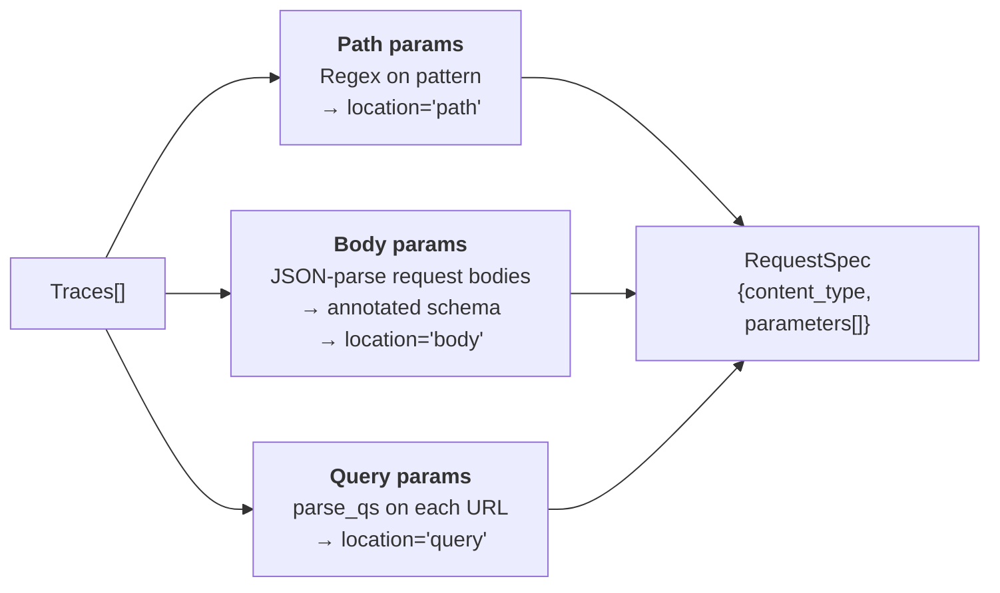
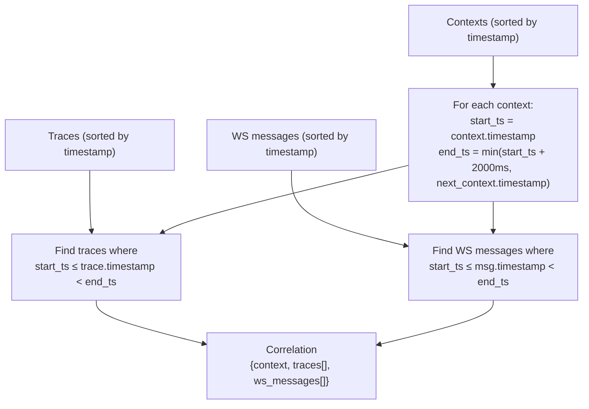

# Step 3 — Mechanical Extraction

> `MechanicalStep[(list[EndpointGroup], list[Trace], list[Correlation]), list[EndpointSpec]]`
>
> **In:** endpoint groups + filtered traces + correlations — **Out:** mechanical endpoint specs with annotated schemas

[← Back to overview](./00-overview.md)

---

## Purpose

For each endpoint group from Step 2, extract all mechanical information: parameters, annotated schemas, UI triggers, auth requirement. This produces structured data that Step 4 sends to the LLM.

No LLM involved — pure code.

## Flow

---

## `_find_traces_for_group`

Two-pass matching to find traces belonging to an endpoint group:

1. **Exact URL set match**: `trace.request.url in group.urls` AND `method` match
2. **Regex fallback**: converts `group.pattern` to regex (`{param}` → `[^/]+`), matches against the URL path. Catches traces the LLM didn't explicitly list.

## `_build_endpoint_mechanical`

Produces an `EndpointSpec` with:
- **`id`**: generated from method + path (e.g. `get_users_user_id`)
- **`ui_triggers`**: matched from correlations (see [Correlator](#correlator) below)
- **`request`**: from `_build_request_spec()` — see [Parameter extraction](#parameter-extraction)
- **`responses`**: from `_build_response_specs()` — see [Response extraction](#response-extraction)
- **`requires_auth`**: true if any trace has `Authorization` header or auth-related cookies
- **`observed_count`** + **`source_trace_refs`**

---

## Annotated Schemas

Schemas and observed values are merged into a single compact representation. Each property carries its type, optional format, and an `observed` list of up to 5 values seen in traces. Properties present in all samples are marked `required`.

**Why annotated schemas instead of schema + sample bodies:**
- More compact — one object instead of schema + 3 truncated bodies
- Direct signal for enum detection: `role` has only 2 distinct values → likely an enum
- Step 4 (LLM) receives structured data, not raw bodies to parse

### `_build_annotated_schema` (to implement)

1. Collects all keys across all JSON samples (union)
2. For each key:
   - Infers type from values (`string`, `integer`, `number`, `boolean`, `array`, `object`)
   - Detects string format: `date-time`, `date`, `email`, `uuid`, `uri`
   - Collects unique observed values (up to 5)
   - Marks as required if present in all samples

---

## Parameter Extraction

`_build_request_spec` extracts parameters from 3 sources:

**Path parameters**: extracted from `{param_name}` in the pattern string via regex `\{(\w+)\}`.

**Body parameters**: JSON request bodies are parsed, all dict samples are merged via `_build_annotated_schema`.

**Query parameters**: `urllib.parse.parse_qs` on each trace URL. Type is inferred from observed string values (all digits → integer, etc.).

## Response Extraction

`_build_response_specs` groups traces by HTTP status code, then for each status:
- Takes content-type from first trace
- JSON-parses all response bodies → collects dict samples
- Builds annotated schema via `_build_annotated_schema`

---

## Correlator

`correlate()` matches UI contexts to API traces using a time window.

- **Window**: 2000ms (`DEFAULT_WINDOW_MS`) after each context event
- **Window cap**: capped at the next context's timestamp to avoid overlap
- **Output**: `list[Correlation]`, one per context

The correlations are used in `_build_endpoint_mechanical` to populate `ui_triggers` — matching traces against their correlated UI contexts.
